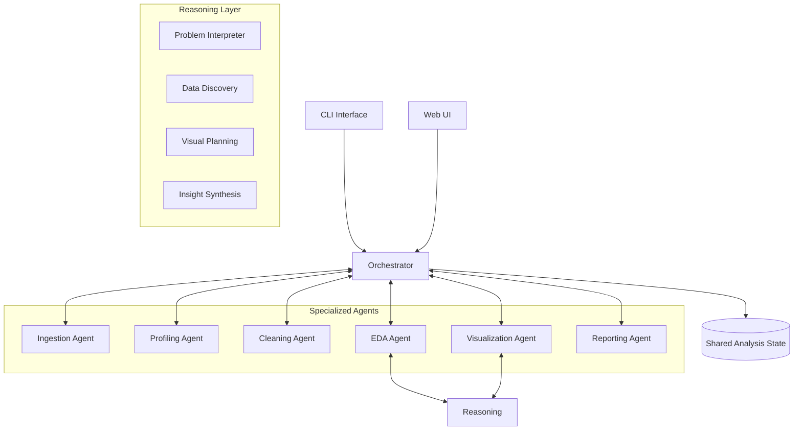

<div align="center">
  
  <h1>Multi-Agent Analyst</h1>
  <p><strong>A sophisticated multi-agent orchestration framework for autonomous data analysis and insight generation.</strong></p>

  [](https://www.python.org/downloads/release/python-3110/)
  [](https://opensource.org/licenses/MIT)
  [](https://pola.rs/)
  [](https://typer.tiangolo.com/)
</div>

---

## 🌟 Overview

**Multi-Agent Analyst** is a high-performance CLI and Web-based tool that leverages a team of specialized AI agents to automate the end-to-end data analysis lifecycle. From raw data ingestion to complex reasoning and visual reporting, it provides a seamless, autonomous experience for data scientists and analysts.

Built with **Polars** for lightning-fast data processing and **Google Gemini/GenAI** for intelligent reasoning, this project demonstrates a robust implementation of the **Actor Model** and **State Management** in a multi-agent environment.

## 🏗️ Architecture

The system follows a modular, decoupled architecture where each agent is responsible for a specific domain of the analysis pipeline.



## 🚀 Key Features

-   📥 **Intelligent Ingestion**: Automatically detects and loads CSV, XLSX, JSON, Parquet, and more.
-   📊 **Automated Profiling**: Deep-dive into data distributions, null values, and statistical summaries.
-   🧹 **Autonomous Cleaning**: Smart handling of missing values, duplicates, and type coercion.
-   📈 **Advanced EDA**: Automated correlation analysis, outlier detection, and trend discovery.
-   🎨 **Visual Storytelling**: Generates production-ready Plotly and Matplotlib visualizations.
-   📝 **Insightful Reporting**: Synthesizes analysis into comprehensive Markdown and HTML reports.
-   🧠 **Reasoning Engine**: Uses LLMs to interpret business problems and plan the analysis strategy.
-   🌐 **Web Dashboard**: Interactive FastAPI-driven web interface for real-time monitoring and results.

## 🛠️ Installation

Prerequisites: Python 3.11+ and `uv` (recommended).

```bash
# Clone the repository
git clone https://github.com/yourusername/multi-agent-analyst.git
cd multi-agent-analyst

# Install dependencies using uv
uv pip install -e ".[dev]"
```

## 📖 Quick Start

```bash
# Run the full analysis pipeline on a dataset
analyst run data.csv

# Launch the interactive web dashboard
analyst serve
```

## ⚙️ Configuration

Customize the agent behaviors via `analyst.toml`:

```toml
[cleaning]
numeric_fill_strategy = "mean"   # mean | median | zero | drop

[visualization]
theme = "dark"
format = "both"                  # png | html | both
```

## 🧪 Testing

```bash
uv run pytest tests/ -v
```

## 🗺️ Roadmap

- [ ] Support for SQL database ingestion.
- [ ] Multi-user authentication for the Web UI.
- [ ] Custom agent plugin architecture.
- [ ] Integration with LangGraph for more complex workflows.

## 📄 License

This project is licensed under the MIT License - see the [LICENSE](LICENSE) file for details.

---

<p align="center">Made with ❤️ by Mudabbir</p>
